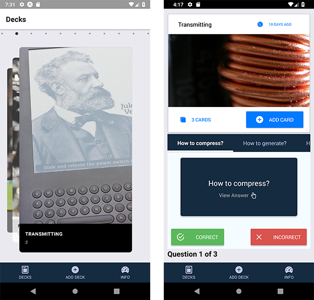

# Overview
Mobile flash cards and quiz app built with React Native for Android Devices only.  Projec & docs are **WIP**

### Usage
- If you're installing for the first time, run `yarn run start:all` to generate the mock api data file, start the local api server & build the app files.
- Update the `.env` in the root directory with the api url which would be your localhost ip address.  If you're using the android studio emulator to test, this ip should be:  `http://10.0.2.2:4000/api`
- Run `react-native start` to start the app server then in a new terminal window, run `react-native run-android` to compile the android package & start the emulator.
- If you've already started the local api server & created the mock api data file, just run `yarn start` to start the npm server/build your api files. Check the `scripts` section of the package.json file for additional commands.

### Functionality Overview
- Allow users to create a deck which can hold an unlimited number of cards.
- Allow users to add a card to a specific deck.
- The front of the card should display the question.
- The back of the card should display the answer.
- Users should be able to quiz themselves on a specific deck and receive a score once they're done.
- Users should receive a notification to remind themselves to study if they haven't already for that day.

# Troubleshooting
If you encounter issues connecting to the local api server, check that you've entered the correct local ip address in the .env file.  This is NOT your public ip.  This is the localhost ip that android studio proxies back to on your machine.  By default it should be:  `10.0.2.2`.

If you encounter issues with compiling, clear all the react native caches, restart the react native server.  
https://gist.github.com/nhancv/d0502bfb0eae29a1ff30c1228a9226cb

This app is only compatible with android devices & has only been tested on windows & linux development environments.  There are some known issues with requiring HTTPS connections when making GET/POST requests (which our local api requires) on MacOS environments.  If you encounter issues with the json server and fetching the api requests when using a mac environment, we can't provide any additional troubleshooting support and suggest you switch to using a windows or linux environment to test further.

